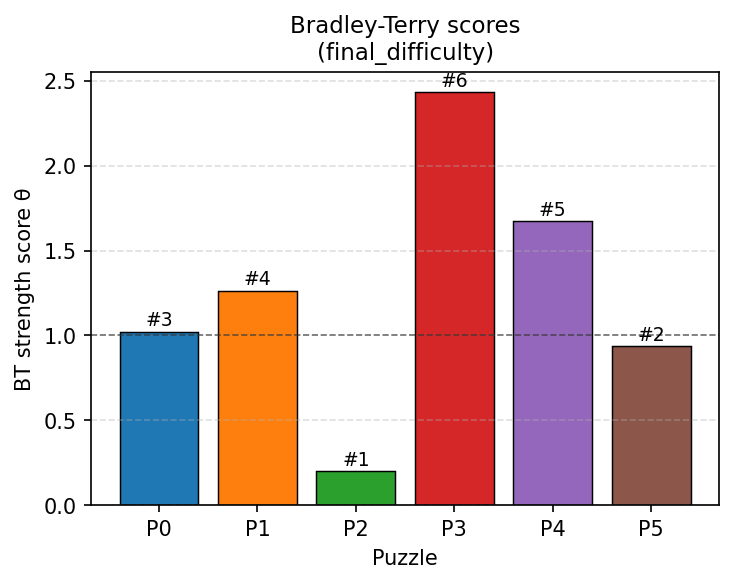
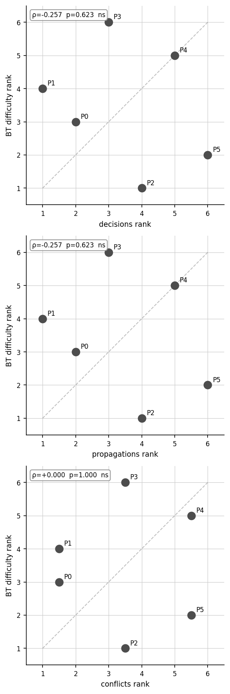
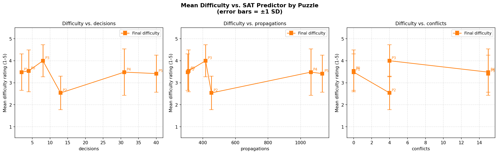
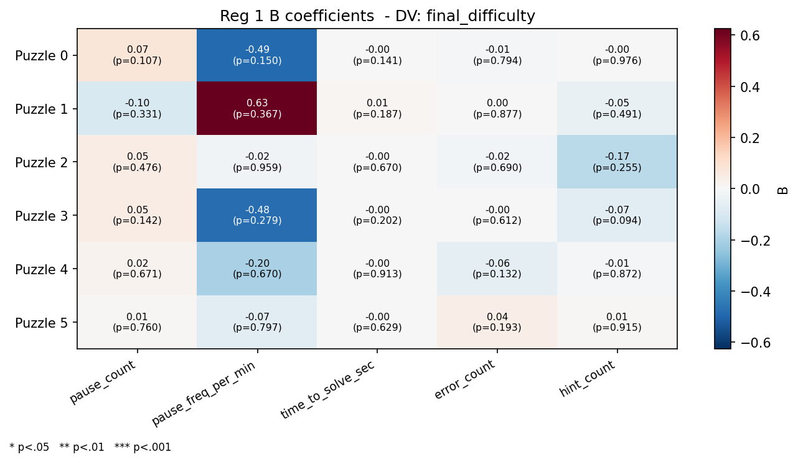
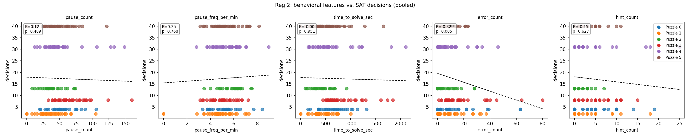
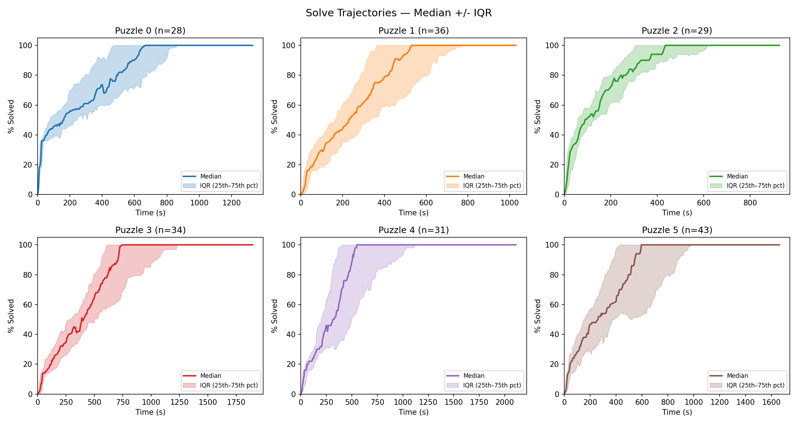
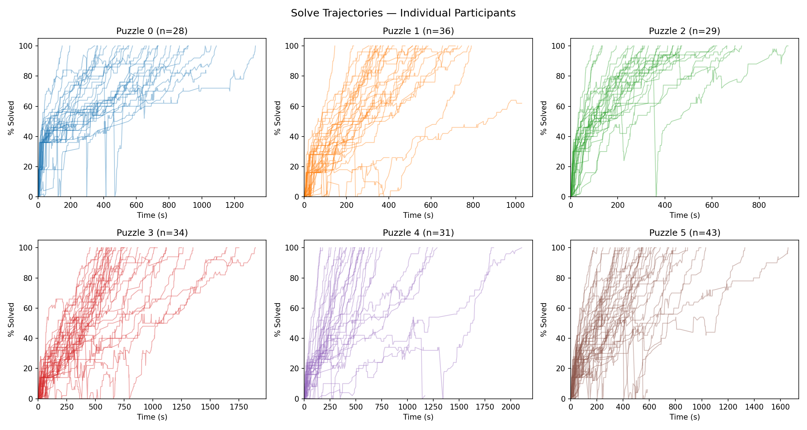
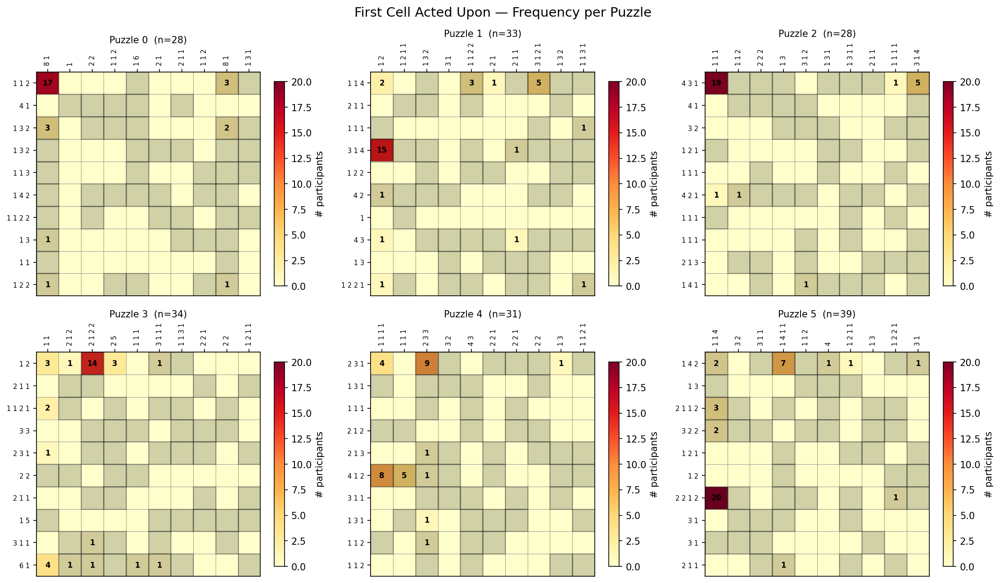

# Results Report — Nonogram Difficulty Study

**Sample:** 67 participants, 201 puzzle-attempt observations (Bing-p21 excluded: incomplete surveys). Experience groups: 27 beginner (skill 1–3), 21 intermediate (4–6), 19 experienced (7–10). Each participant solved 3 of 6 puzzles.

---

## 1. Puzzle Difficulty Ranking

**P2 is the easiest puzzle; P3 is the hardest — by a wide margin, and consistently across both rating types.**

The Bradley-Terry model (which corrects for the incomplete 3-of-6 assignment) gives:

| Rank | Puzzle | BT score (initial) | BT score (final) | Raw mean (initial) |
|------|--------|--------------------|------------------|--------------------|
| 1 | P2 | 0.28 | 0.20 | 2.64 |
| 2–5 | P0, P1, P4, P5 | 0.80–1.47 | 0.94–1.68 | 3.4–3.5 |
| 6 | P3 | 2.56 | 2.43 | 4.15 |

P3's BT score (~2.5×) is roughly 3× P2's and nearly 2× P4's, making it a clear outlier at the hard end. The four middle puzzles cluster tightly in the 3.4–3.5 range with barely separated raw means, which is why raw ranking is sensitive to assignment bias while BT ranking is more stable — P0's raw rank shifts from #5 to #2 after BT adjustment.

Rankings are stable across initial and final difficulty ratings, and largely consistent across experience groups, though experienced participants rate **P0 notably harder** (BT rank #6 vs. #2 pooled), suggesting P0 may be deceptively easy for novices but genuinely challenging for those who engage more deeply.

---

## 2. SAT Metrics vs. Human Difficulty

**SAT solver metrics do not significantly predict human difficulty ratings at n=6 puzzles.**

All Spearman ρ values are non-significant (threshold for p<0.05 with n=6 is |ρ|≥0.886). The pattern across the scatter grid is near-random scatter — no consistent monotone relationship between SAT rank and BT difficulty rank is visible.

Notably, **decisions and propagations show slightly negative ρ** (pooled: ρ≈−0.03 initial, −0.26 final). This is counterintuitive: puzzles that require more SAT solver work are not rated harder by humans. The mean difficulty plot makes this clear — P5 has the highest decisions count (~40) but sits at a middling human rating (~3.4), while P3 scores the highest human difficulty with only moderate decisions (~8).

**Conflicts** shows the weakest but most positive signal (ρ≈+0.24 initial, 0.00 final), suggesting it may be marginally better aligned with human perception than search-effort metrics, though still far from significance.

**Group analysis:** The experienced group shows the strongest (still non-significant) negative SAT correlation (ρ≈−0.60 for decisions), meaning experienced solvers rate the SAT-hard puzzles as relatively easier — consistent with their ability to exploit structure that the SAT solver searches for blindly.

---

## 3. Behavioral Predictors of Difficulty

**No single behavioral feature reliably predicts difficulty ratings after controlling for the others, but `pause_freq_per_min` is the most consistent signal.**

The coefficient heatmap (Reg 1: behavioral → initial difficulty) shows:

- **`pause_freq_per_min`** has the largest coefficients, uniformly negative for P0, P1, P2, P3 and positive for P4. More frequent pauses → lower perceived difficulty on most puzzles, but the opposite on P4. This likely reflects different solve strategies: deliberate pausing on constraint-heavy puzzles (P0–P3) signals careful reasoning rather than confusion, while pausing on P4 may reflect being stuck.
- **`hint_count`** is notably negative for P2 (using hints there reduces perceived difficulty), which makes sense given P2 is already easy — hints in easy contexts don't inflate difficulty perception.
- **`time_to_solve_sec`** and **`error_count`** contribute weakly and inconsistently across puzzles.

**Pooled regression (all puzzles):** R²=0.075 for initial difficulty, 0.082 for final — the behavioral features together explain only ~8% of variance. No individual predictor reaches significance.

**One significant cross-domain finding:** In Reg 2 (behavioral → SAT decisions), `error_count` is significantly negative (B=−0.32, p=0.005 pooled). Puzzles with fewer SAT decisions (solver-easy puzzles) generate more human errors — participants make more cell-filling mistakes on the puzzles the solver handles trivially. This is the clearest measurable mismatch between SAT complexity and human behavior.

**By experience group:** The beginner group shows the strongest behavioral signal — for puzzle 0, `pause_count`, `pause_freq_per_min`, and `time_to_solve_sec` are jointly significant predictors of **final** difficulty (R²=0.745). Experienced participants' difficulty ratings are largely unrelated to their behavioral trace (R²≈0.21 pooled, no significant predictors), suggesting they form difficulty judgments on grounds not captured by these behavioral features.

---

## 4. Solve Trajectories

**Trajectories reveal how solving structure differs across puzzles, independent of ratings.**

- **P0** (blue): The most distinctive pattern — participants jump immediately to ~40% solved in the first 30 seconds. This reflects highly constrained initial cells (long clues that can be filled deterministically without any cross-referencing). The remainder of the puzzle requires inference.
- **P2** (green): Fastest median completion (~550s) with the narrowest IQR — the most consistently solved puzzle, matching its lowest difficulty rating.
- **P3** (red): Longest median completion time (~1300s) and widest IQR — the hardest and most variable. The trajectory shows a stepped pattern: participants make progress in bursts, consistent with insight-based solving.
- **P4** (purple): Starts slowly (near zero at ~100s), then accelerates sharply around 300s — suggesting a necessary unlock point that, once found, lets the puzzle fall quickly.
- **P5** (brown): Longest absolute duration tail, widest IQR at the upper end — some participants take over 1600s. This matches its large participant count (n=43) and moderately high SAT decisions.
- **P1** (orange): Steady linear climb from near-zero, no distinctive early burst.

---

## 5. First-Cell Entry Points

**Participants concentrate on specific starting cells per puzzle, reflecting the puzzle's clue structure.**

- **P0:** 17/28 (61%) start at the same top-left cell — the most concentrated entry point of any puzzle.
- **P2:** 19/28 (68%) start at one cell — equally concentrated, consistent with a single long clue dominating the top-left.
- **P5:** 20/39 (51%) share a starting cell, but positioned in the bottom-left, reflecting a dominant clue in a different quadrant.
- **P4:** Two competing entry points (~8 and ~9 participants), showing the puzzle has two plausible starting constraints — this may contribute to its high IQR in solve trajectories.
- **P3:** First actions spread across the top row, suggesting no single dominant starting constraint, which correlates with its high difficulty and variable trajectories.

The strong concentration on P0, P2, and P5 shows these puzzles have obvious "first moves" that channel all participants into the same solving sequence — likely reducing perceived difficulty. P3 and P4's dispersed entry points correlate with their harder, more variable experience.

---

## Summary

| Finding | Strength |
|---------|----------|
| P2 easiest, P3 hardest — agreed by BT, raw means, trajectories, first-cell spread | Strong |
| SAT metrics do not predict human difficulty | Clear (n=6 limits statistical power) |
| Error count negatively predicts SAT decisions — solver-easy ≠ human-easy | Significant (p=0.005) |
| Behavioral features explain ~8% of difficulty variance pooled | Weak, no significant individual predictors |
| Beginners' difficulty ratings more behaviourally predictable than experts' | Moderate |
| P0's "fast start" and P3's "stepped bursts" reflect distinct cognitive solving modes | Qualitative |
