# A guided walkthrough of the open-text coding & expertise-adjustment analysis

*Human and Computational Measures of Nonogram Puzzle Difficulty (University of Toronto)*

This report covers two tasks: (A) thematic coding of the open-text survey responses and what we can learn from the codes, and (B) how to factor a participant's reported expertise into reported and behavioural difficulty. It walks through **every figure** in the `figures/` folder, and explains what each one is telling us and why it matters for the research question: *do SAT-solver statistics line up with how hard humans find a puzzle, and how should a participant's expertise be taken into account?*

Everything here is **additive and read-only** with respect to the rest of the repository. No logs, scripts, or outputs belonging to other researchers were changed. All new code, data, and figures live in `riyad-analysis/`.

---

## 0. The big picture in one paragraph

We took 68 raw participant logs, rebuilt a clean table of 204 participant-puzzle attempts, and tackled two jobs. **Job A** turned the messy free-text answers (why was this hard? what was your strategy?) into structured, countable labels so they can be analysed like any other variable. **Job B** built a single, trustworthy number for each participant's expertise and then tested five different ways of "subtracting out" that expertise so puzzles can be compared fairly. The headline findings: (1) the things humans *say* make a puzzle hard line up with the things they actually *do* (validating the self-reports), and (2) expertise barely changes the 1–5 difficulty *rating* but strongly changes *behaviour* (time, hints) — so behaviour must be expertise-adjusted, and expertise mostly matters as an **interaction** that softens how strongly SAT-hard puzzles feel hard.

---

## 1. The data foundation

Before any analysis, `nono_data.py` reads every log in `backend/logs` (both `.ndjson` and `.json` formats) and reconstructs, for each attempt:

- **Behaviour** — solve time, number of moves/drags/cell-changes, hints used, incorrect submissions, and whether the puzzle was solved.
- **Subjective ratings** — the immediate difficulty rating (1–5), the revised rating, the change between them, and self-reported guessing frequency.
- **Background** — six expertise items (see Part B).
- **Free text** — the difficulty explanation, the strategy description, and the general comments.

This gives **204 attempts across 6 puzzles (ids 0–5)** from **68 participants**. This one loader feeds both halves of the analysis, so every number in this report comes from the same reconstruction of the data.

---

# Part A — Making sense of the open-text answers

People typed answers to three open questions: *why was this puzzle this difficulty?*, *what strategy did you use?*, and *general comments*. Free text can't be averaged or correlated directly, so the first job was to convert it into structured labels through **thematic coding**.

## A.1 How the coding was done

We read **all 408 free-text responses** (`derived/text_responses.csv`) and built two label sets from the bottom up — meaning the categories came out of what participants actually wrote, not a pre-existing list:

- **13 "difficulty themes"** applied to the difficulty explanations and comments — e.g. `FOOT` (starting footholds / forced lines), `CLUE` (clue magnitude), `PROP` (constraint propagation), `AMBIG` (combinatorial ambiguity), `GUESS` (guessing), `HINT`, `ERR` (mistakes), `LEARN` (learning/fatigue), `LOAD` (cognitive load), `VIS` (visual layout), `TIME`, `UI`, `AFF` (affect/confidence).
- **8 "strategies"** applied to the strategy answers — `S_FORCED` (forced-line solving), `S_CONSTR` (most-constrained-first), `S_OVERLAP` (overlap analysis), `S_EDGE` (edge anchoring), `S_CROSS` (row/column cross-referencing), `S_NEG` (negative marking / X-ing empties), `S_TRIAL` (trial-and-error), `S_HINT` (hint-as-tool).

The full definitions are in `derived/codebook.md`. The coding is **multi-label** (a single answer can get several codes) and is stored as plain data in `codes.py`, mapping each response id to its codes. That means the coding is reproducible, auditable, and can be re-run or edited deterministically — and a second human coder could later re-code the same ids to report inter-rater reliability.

Of the 408 responses, the breakdown of what was informative enough to code:

| Question                     | Total | Informative | Coded                       |
| ---------------------------- | ----- | ----------- | --------------------------- |
| Per-puzzle difficulty reason | 204   | 174         | 167                         |
| General comments             | 68    | 55          | 54                          |
| Strategy description         | 68    | 66          | 65                          |
| "Other" size experience      | 68    | 1           | 0 (not difficulty-relevant) |

## A.2 What do people actually talk about?

The first thing to ask of coded data is simply: how often does each label show up? This tells us what humans pay attention to when judging difficulty.

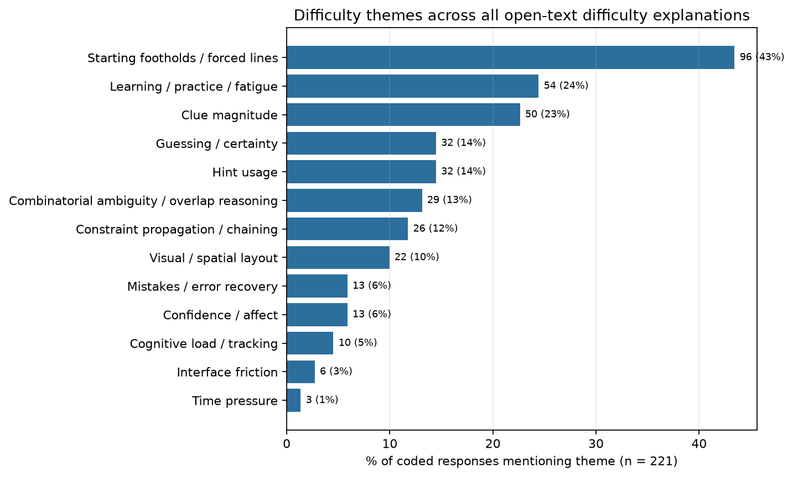

**How to read it:** each bar is one difficulty theme; the length is the share of the 221 coded difficulty responses that mention it.

**What it tells us:** the runaway winner is `FOOT` **— starting footholds / forced lines (43%)**. Almost half of all difficulty talk is about whether the puzzle handed you an easy place to start: "freebies", full rows, lines that sum to the grid width, or the frustration of "not knowing where to start". After that come `LEARN` **learning/practice/fatigue (24%)** — people noticing they warmed up or tired out over the session — and `CLUE` **clue magnitude (23%)** — big numbers feel easy, lots of 1s feel hard. Guessing, hints, and combinatorial ambiguity sit around 13–14%. The purely cosmetic concerns (time pressure, interface) are rare. **Takeaway:** human difficulty is dominated by *how the puzzle opens up*, which is exactly the moment a SAT solver would either propagate cleanly or start branching.

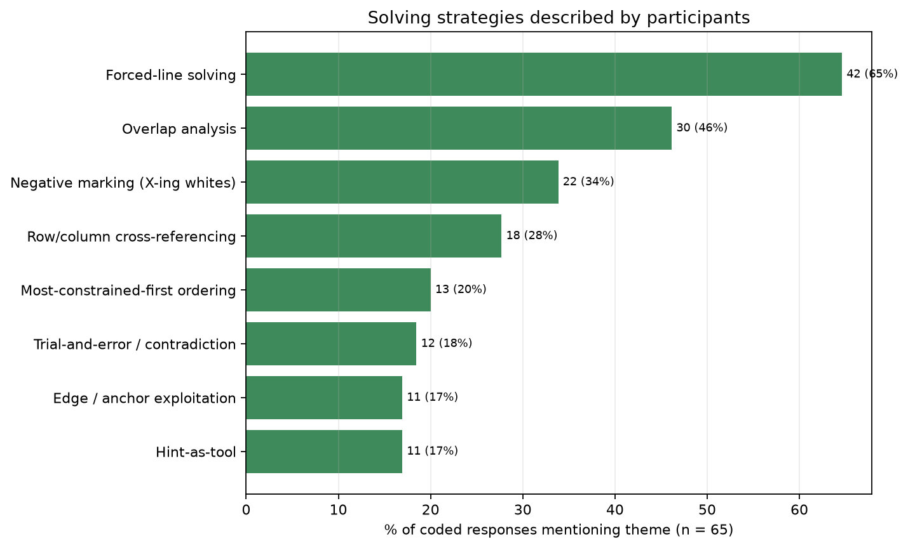

**How to read it:** same idea, but for the 65 coded strategy answers.

**What it tells us:** there's a clear, shared "expert workflow". **Forced-line solving (65%)** and **overlap analysis (46%)** dominate, then **negative marking (34%)** and **row/column cross-referencing (28%)**. The more advanced or niche moves (most-constrained-first ordering, edge anchoring, explicit trial-and-error, using hints as a tool) are described by a minority. This is reassuring: people are using the canonical, logically-sound Nonogram techniques, not random poking.

## A.3 Which labels travel together?

Because the coding is multi-label, we can ask which themes/strategies tend to appear in the *same* answer. We measure this with **Jaccard overlap** (the share of responses mentioning *either* label that mention *both*). Higher = more co-mentioned.

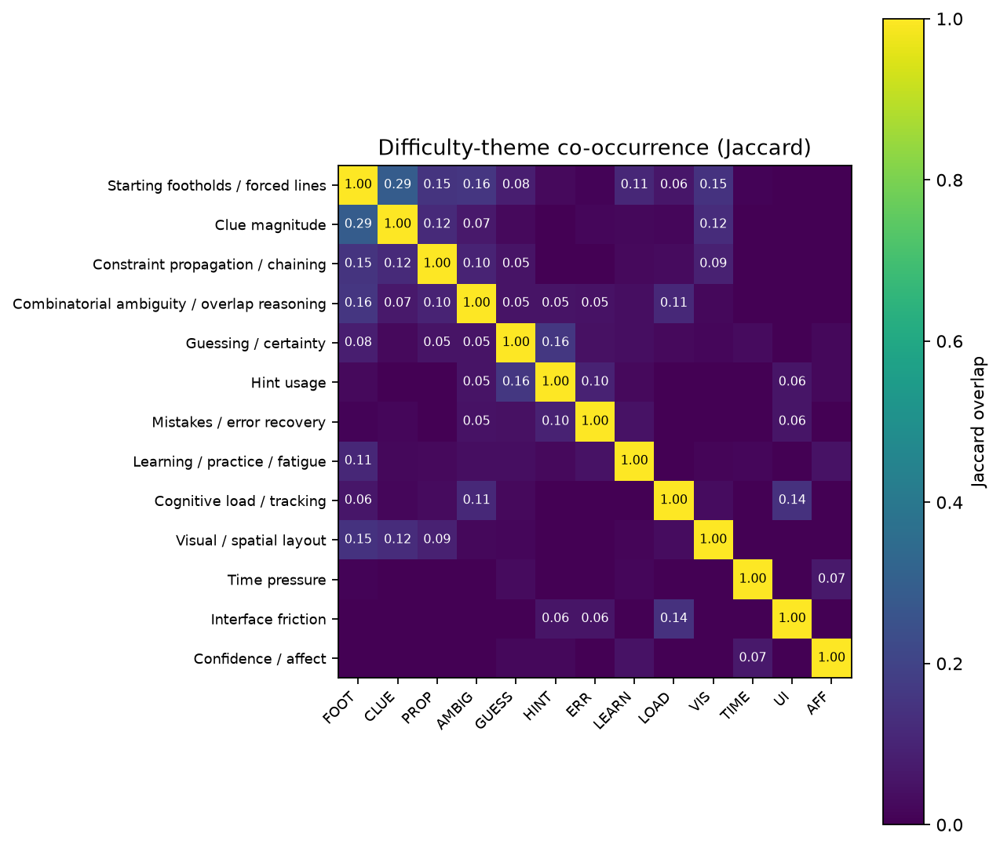
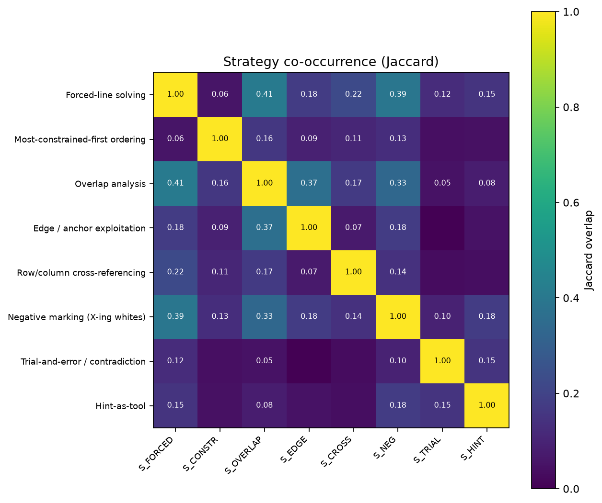

**How to read them:** each cell is the overlap between a row label and a column label; the diagonal is always 1.0 (a label fully overlaps itself); brighter = more overlap.

**Difficulty themes (left):** the strongest pairing is `FOOT`↔`CLUE` (0.29) — people talk about footholds and clue sizes in the same breath, which makes sense because big clues *are* the footholds. `FOOT` also links modestly to ambiguity, propagation, learning, and visual layout, confirming it as the central hub of difficulty talk.

**Strategies (right):** the canonical solving chain literally travels together — **forced-line solving ↔ overlap analysis (0.41)**, **forced-line ↔ negative marking (0.39)**, and **overlap ↔ edge/negative-marking (0.33–0.37)**. In other words, people who describe one core technique tend to describe the whole sequence: find forced lines → reason about overlaps → mark the empties → cross-reference. Hint-use and trial-and-error sit off to the side, as you'd expect from fallback tactics.

## A.4 Do the labels actually relate to difficulty? (the useful part)

Counting labels is descriptive; the real payoff is connecting them to the numeric variables.

### Labels predict the difficulty rating in sensible directions

For each theme we compared the difficulty rating when the theme was *present* vs *absent*, using the Mann-Whitney U test (a rank-based test that doesn't assume a bell curve) with Benjamini-Hochberg correction for testing many themes at once.

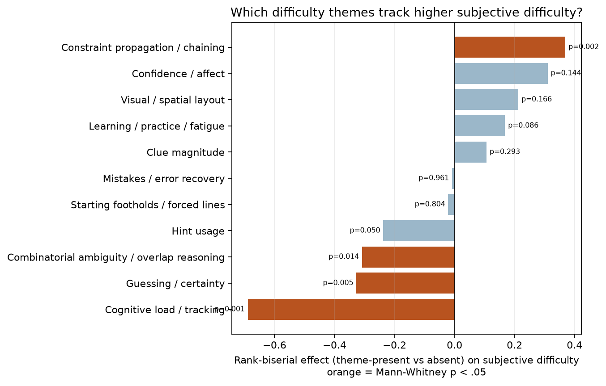

**How to read it:** bars point right if mentioning the theme goes with *higher* difficulty, left if *lower*. The length is the rank-biserial effect size (how strongly), and orange bars are statistically significant (p < .05).

**What it tells us — and it's a clean, interpretable story:**

- `PROP` **constraint propagation → easier** (mean 2.92 vs 3.52). When people say deductions chained smoothly, they rated the puzzle easy. Smooth propagation is the human version of a solver that never has to branch.
- `LOAD` **cognitive load → much harder** (4.57 vs 3.38). Feeling overwhelmed / having to track lots of state is the strongest "harder" signal.
- `GUESS` **guessing → harder** and `AMBIG` **ambiguity → harder**. Both are the flip side of propagation: when forced logic runs out, you guess, and it feels hard.

This is exactly the qualitative mechanism we'd want behind a SAT conflicts↔difficulty link: **conflicts happen precisely when forced propagation runs out and search/guessing begins**, and that's the moment humans report as hard.

### Labels match the logged behaviour (convergent validity)

If the coding is trustworthy, what people *say* should match what they *did*. This is the most important validity check in Part A.

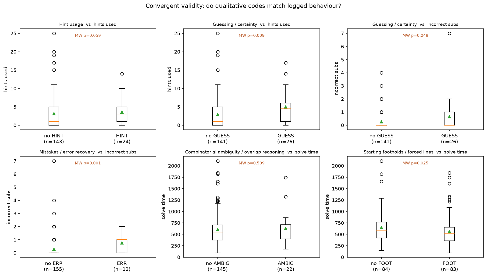

**How to read it:** six box-plots, each splitting attempts by whether a code is present, against a behavioural measure. The p-value is the Mann-Whitney test; the green triangle is the mean.

**What it tells us — the codes line up with behaviour:**

- `ERR` **(mentions a mistake) → more incorrect submissions** (0.75 vs 0.28, p = .001). People who said they erred genuinely submitted more wrong answers.
- `GUESS` **→ more hints used** (4.96 vs 2.88, p = .009) **and more incorrect submissions** (p = .049). Self-reported guessing shows up in the logs.
- `FOOT` **→ faster solve times** (563 s vs 650 s, p = .025). Talking about easy footholds goes with actually finishing faster.
- `HINT` **→ more hints used** (p = .059, right direction).

Because the words match the behaviour, we can use the qualitative themes to *explain* the quantitative patterns rather than treat them as a separate, untrusted data source — which is exactly the supplementary-evidence role the study intended for the open text.

### Strategy breadth is a marker of real expertise

Finally, we counted how many *distinct* strategies each participant described and related that to skill and performance.

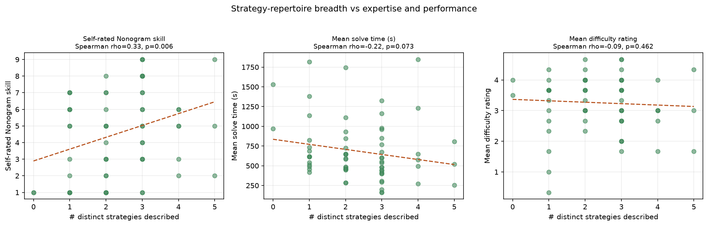

**How to read it:** three scatterplots; x-axis is the number of distinct strategies a person described, with a Spearman correlation in each title.

**What it tells us:** describing more strategies tracks **higher self-rated skill** (ρ = .33, p = .006), **faster solving** (ρ = −.22, trend, p = .073), and is essentially flat against the difficulty rating (ρ = −.09, n.s.). So a richer strategy vocabulary is a sign of genuine expertise and efficiency, not just confidence or talkativeness. (Separately, breadth correlates negatively with hints used, ρ ≈ −.33 — articulate solvers lean on hints less.)

## A.5 How to use Part A in the paper

- Use the prevalence + co-occurrence figures to describe **what humans attend to** (footholds, clue magnitude, the forced→overlap→mark→cross-reference workflow) versus what the SAT encoding measures.
- Use the convergent-validity panel to argue the **self-reports are trustworthy**.
- Use the `PROP`/`AMBIG`/`GUESS`/`LOAD` ↔ rating links as the **human mechanism** behind any SAT-conflicts↔difficulty relationship.

---

# Part B — Factoring in a participant's expertise

A puzzle that's "hard" for a beginner may be trivial for an expert. To compare puzzles fairly, we need (1) a single dependable measure of each participant's expertise, and (2) a principled way to remove its influence.

## B.1 Building one expertise number from six questions

Participants reported expertise on six items: Nonogram skill (1–10), general puzzle skill (1–10), how often they play Nonograms, how often they play puzzles, the range of Nonogram sizes they've tried, and the range of logic-puzzle types they know. We combined these three ways (z-mean, PCA, factor analysis) in `04_build_expertise_score.py`.

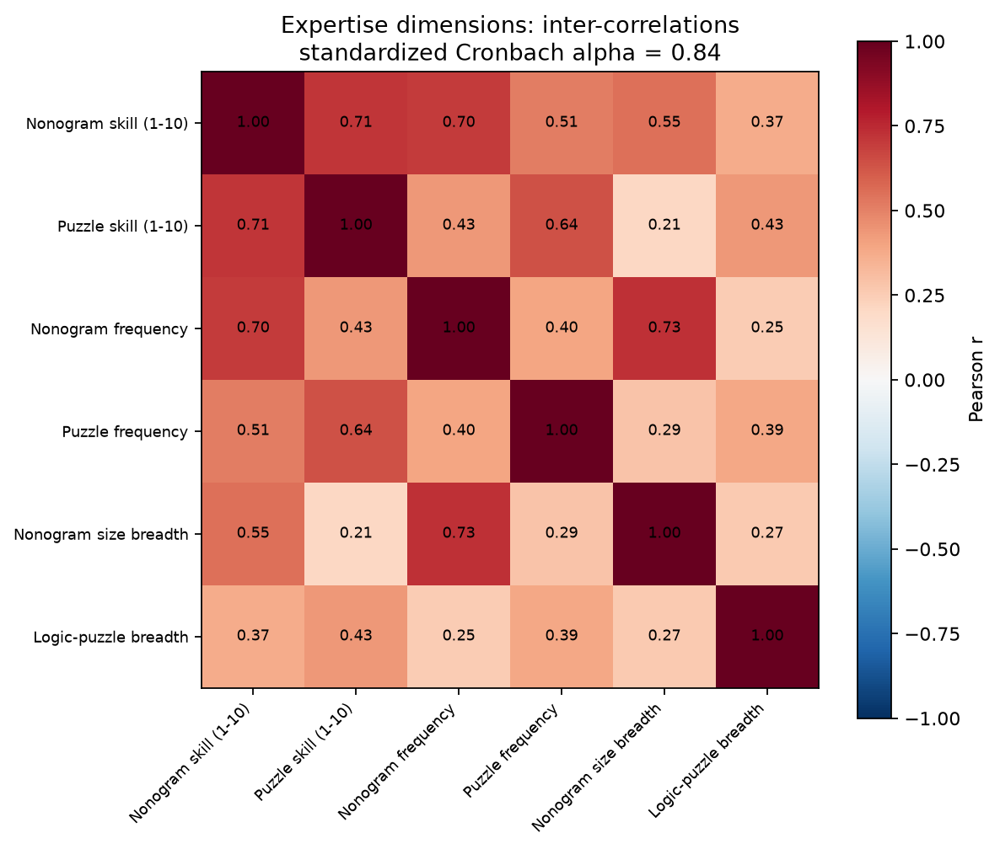

**How to read it:** a correlation heatmap of the six items; darker red = more positively correlated. The title reports the standardized Cronbach's α.

**What it tells us:** all six items are **positively inter-correlated** (every cell is red, no negatives), and together they're **internally consistent** (standardized Cronbach **α = 0.84**, comfortably above the 0.7 rule of thumb). This means the six questions really are measuring one underlying thing, so it's legitimate to collapse them into a single score. The strongest pairings (skill items together ~0.71; frequency and size-breadth ~0.73) are intuitive.

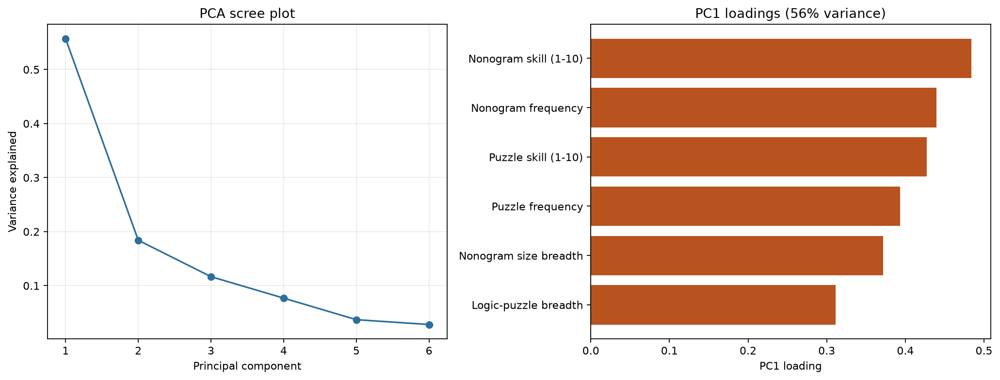

**How to read it:** left = how much variance each principal component explains (a "scree plot"); right = how heavily each item loads on the first component.

**What it tells us:** there's a sharp "elbow" after the first component — **PC1 alone explains 56% of the variance**, far more than the rest — and **all six items load positively** on it. That's the classic signature of a single dominant dimension: a general "expertise" factor. No item pulls in the opposite direction, so a simple positive combination is well justified.

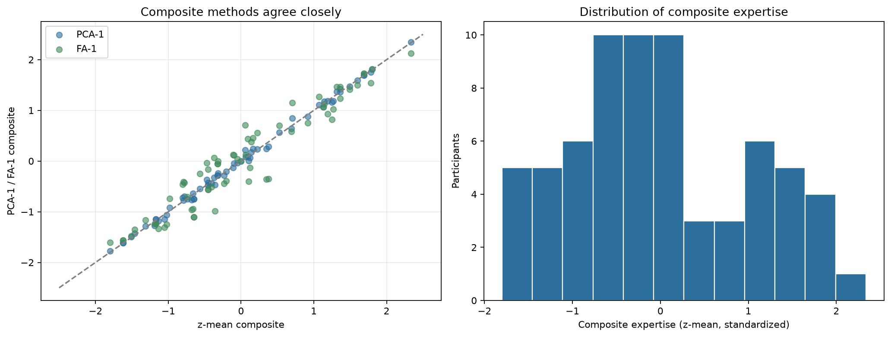

**How to read it:** left = the PCA and factor-analysis scores plotted against the simple z-mean (points hugging the dashed line = agreement); right = the distribution of the final expertise score across participants.

**What it tells us:** the three different recipes produce **almost identical rankings** (Spearman 0.95–0.996), so the choice of method doesn't matter. We therefore use the **equal-weight z-mean** as the primary score because it's the simplest and most transparent, with PCA as a robustness check. The right panel shows expertise is spread across the sample (slightly more people on the lower end), giving us real variation to work with. Per-participant scores and novice/intermediate/expert tiers are saved in `derived/participant_expertise.csv`.

## B.2 Does expertise even need adjusting for? Yes — but selectively

Before choosing an adjustment method, we checked **which outcomes expertise actually affects**. This is the single most important result in Part B, because it tells us where adjustment matters.

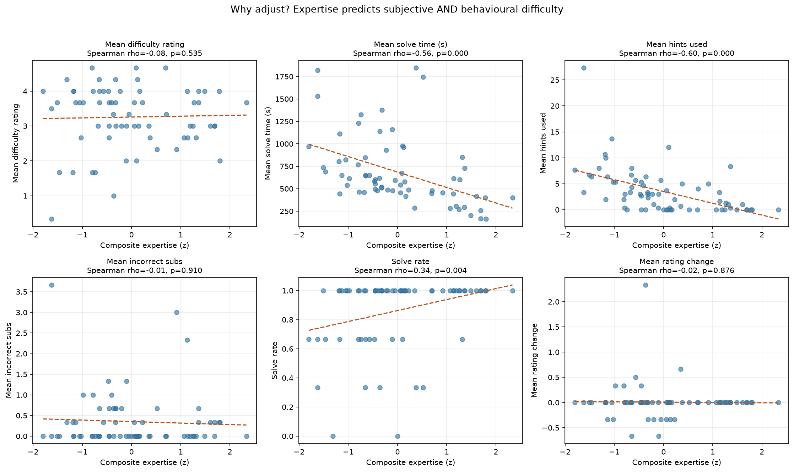

**How to read it:** six scatterplots of each participant's mean outcome against their expertise score, each with a Spearman correlation.

**What it tells us — a striking split:**

| Outcome                    | Spearman ρ with expertise | Significant?          |
| -------------------------- | ------------------------- | --------------------- |
| Mean solve time            | **−0.56**                 | yes (p < 1e-6)        |
| Mean hints used            | **−0.60**                 | yes (p < 1e-7)        |
| Solve rate                 | **+0.34**                 | yes (p = .004)        |
| Mean actions               | −0.23                     | borderline (p = .058) |
| **Mean difficulty rating** | **−0.08**                 | **no (p = .53)**      |
| Mean incorrect submissions | −0.01                     | no                    |
| Mean rating change         | −0.02                     | no                    |

Expertise **strongly shapes behaviour** — experts solve faster, use far fewer hints, and succeed more often — but is **essentially unrelated to the 1–5 difficulty rating**. The most likely explanation is **self-anchoring**: people rate a puzzle against their *own* expectations, so an expert and a novice can both call a puzzle "a 3" for different reasons.

**The practical implication is the whole point of Part B:** *behavioural* difficulty must be expertise-adjusted to be comparable across people, but the *subjective rating* needs adjustment far less (and mainly through interactions, see B.4).

## B.3 Five ways to adjust, compared

`05_expertise_adjustment.py` implements and compares:

- **M0 Raw** — no adjustment (baseline).
- **M1 Within-participant centring** — subtract each person's own average. Clean in principle, but with only 3 puzzles per participant under unbalanced assignment it also throws away real between-puzzle differences.
- **M2 Residualization** — regress the outcome on expertise (+ order) and keep the leftover.
- **M3 Covariate mixed model** — `outcome ~ puzzle + expertise + order` with a per-participant random intercept, then read off the expertise-adjusted puzzle difficulties.
- **M4 Stratification** — estimate difficulty separately within novice/intermediate/expert tiers.
- **M5 Expertise × SAT interaction** — does expertise change how strongly conflicts drive difficulty?

### Subjective difficulty: adjustment barely changes anything

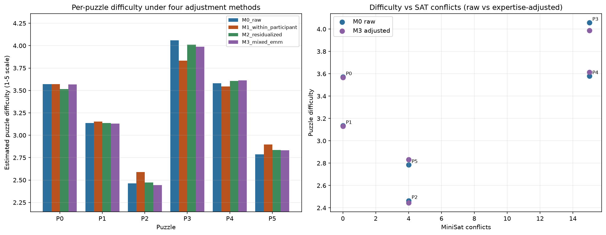

**How to read it:** left = each puzzle's estimated difficulty under four methods (grouped bars); right = puzzle difficulty vs MiniSat conflicts, raw vs adjusted.

**What it tells us:** because expertise barely touches the rating, the bars for **raw (M0), residualized (M2), and mixed-model (M3) are nearly identical** — and all give the *same* correlation with SAT conflicts (Spearman ρ = 0.48 across the 6 puzzles, exploratory). The mixed-model expertise coefficient on the rating is non-significant (β = 0.04, p = .68). Only **M1 within-participant centring** deviates and actually *weakens* the conflicts correlation (ρ = 0.24) — a concrete warning against blindly centring when puzzle assignment is unbalanced. The right panel makes the point visually: the raw and adjusted points sit almost on top of each other, and difficulty rises with conflicts (the two zero-conflict puzzles P0/P1 are rated very differently, but the high-conflict P3/P4 are clearly the hardest).

### Behavioural difficulty: adjustment matters and *helps*

This is the opposite story. Residualizing behaviour for expertise removes large, highly significant expertise effects (about **−154 s of solve time** and **−2.3 hints per expertise SD**, both p < 1e-9) and **strengthens** alignment with the SAT measure: the solve-time↔conflicts correlation across the 6 puzzles rises from **0.36 (raw) to 0.72 (expertise-adjusted)** (`derived/stats_behavioural_adjustment.csv`). In other words, once you strip out who was an expert, the time it takes to solve a puzzle tracks the solver's conflict count much more closely — strong support for using behaviour (properly adjusted) as a difficulty proxy.

### Expertise moderates the SAT→difficulty link

Even though expertise doesn't shift the *average* rating, it changes *how sensitive* people are to hard puzzles.

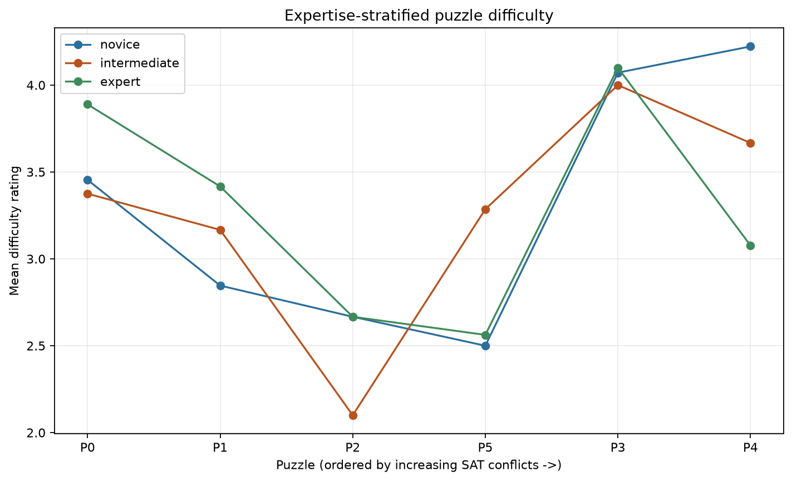

**How to read it:** puzzles are ordered left-to-right by increasing SAT conflicts; one line per expertise tier.

**What it tells us:** on the **hardest puzzles** the tiers separate. The highest-conflict puzzle (P4, far right) is rated about **4.2 by novices but only ~3.1 by experts** — experts feel the SAT-hard puzzle as meaningfully easier. (Note P0 is an exception: experts rate it slightly higher, a reminder these are small per-tier samples.)

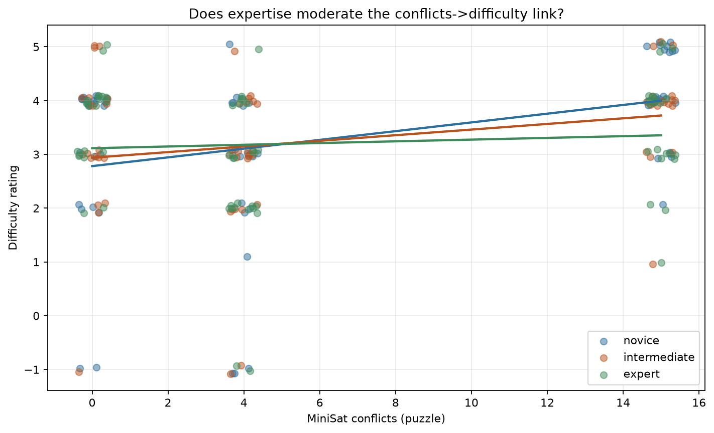

**How to read it:** difficulty vs MiniSat conflicts at the individual-attempt level, with a separate fitted line per tier.

**What it tells us:** all three lines slope **upward** (more conflicts → higher difficulty), but the **novice line is steepest and the expert line is flattest** — they fan out as conflicts increase. Formally, in an attempt-level model with participant-clustered standard errors (n = 204), log-conflicts predict higher difficulty (β = 0.17, p = .006) **and** there is a **significant negative conflicts × expertise interaction** (β = −0.16, p = .014). Plainly: SAT-hard puzzles feel hard to everyone, but **less so the more expert you are**.

> Worth emphasising: this attempt-level model (n = 204) *detects* the conflicts→difficulty effect that the 6-puzzle aggregate correlation is too small to confirm on its own. That's a strong argument for doing the main inference at the attempt level with expertise in the model, and treating the 6-point puzzle correlations as exploratory.

## B.4 Recommended recipe

1. **Expertise score** = equal-weight z-mean of the six standardized background
  items (α = 0.84); include it as a covariate, not something to discard.
2. **Subjective difficulty:** model at the attempt level as
  `difficulty ~ log_conflicts * expertise + order + (1|participant)`.  Expertise mainly enters through the **interaction**, not a main effect.
3. **Behavioural difficulty:** always expertise-adjust (residualize or covary)
  and report raw vs adjusted SAT alignment — adjustment makes it stronger.
4. Keep within-participant centring (M1) as a **robustness check only**, given
  the unbalanced 6-puzzle assignment.
5. Treat all 6-puzzle aggregate correlations as **exploratory**; lean on the
  attempt-level models for inference.

---

## What's in the folder (so it's reproducible)

| File                          | What it does                                                          |
| ----------------------------- | --------------------------------------------------------------------- |
| `nono_data.py`                | Read-only loader: rebuilds the 204-attempt table from `backend/logs`. |
| `01_export_text_responses.py` | Exports all free text for coding.                                     |
| `codes.py`                    | The codebook + the reproducible response→codes mapping.               |
| `02_build_coded_dataset.py`   | Merges text with codes into analysis-ready tables.                    |
| `03_analyze_text.py`          | All of Part A's stats + figures.                                      |
| `04_build_expertise_score.py` | Builds the composite expertise score + diagnostics.                   |
| `05_expertise_adjustment.py`  | The five adjustment methods + figures.                                |
| `run_all.sh`                  | Sets up the environment and runs everything in order.                 |
| `derived/`                    | All output tables (CSV) and the codebook.                             |
| `figures/`                    | All 14 figures used in this report.                                   |

Run `bash run_all.sh` to regenerate every number and figure from scratch.

---

## Limitations (read these before quoting numbers)

- **Only 6 puzzles vary in SAT difficulty**, so puzzle-level correlations (n = 6) are exploratory; the attempt-level models are better powered but share puzzle variance.
- **Expertise and difficulty ratings are self-reported.**
- **The thematic coding is single-coder (LLM-assisted).** A second human coder re-coding the ids in `codes.py` would let you report inter-rater reliability.
- **Puzzle assignment is unbalanced** (29–42 attempts per puzzle), which is exactly why within-participant centring (M1) behaves differently from the other methods.

